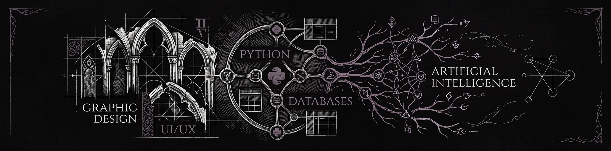

  

<h1 align="center">Hi there, I'm Armin Shaddaman 👋</h1>

  <b>Building the Future, One Line of Code at a Time</b>

---
### 🚀 About Me

I love creating new technology and driving growth in my work and life. Progress should be flexible, not annoying.
---
### 🛠️ My Skills & Interests

- **🤖 Artificial Intelligence & LLMs**  
  Working with cutting-edge language models, prompt engineering, and integrating AI capabilities into real-world applications to make them more intelligent.

- **🐍 Python & Backend Development**  
  Crafting scalable, maintainable server-side architectures. Experienced in REST APIs, database management, and writing efficient Python code for complex systems.

- **⚙️ Bots & Automation**  
  Designing intelligent bots for various platforms and automating repetitive tasks. My goal is to eliminate manual work and boost productivity through clean, reliable scripts.
---
### 🌐 Connect with Me

 

